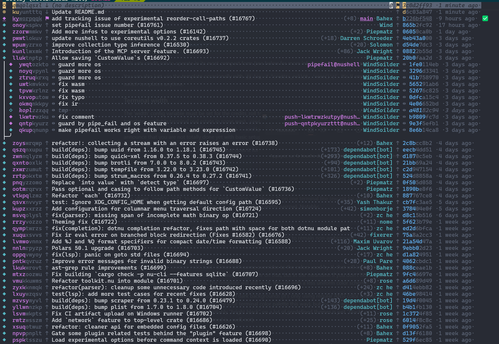

# Reusable config for `jj`

This repo contains the `credits_roll` JJ log template.

It is an opinionated one-liner template that tries its best to show aligned
revision descriptions and data, limit information shown by leaving stuff
implicit when it can be done without introducing unreasonable ambiguity, and use
colors sparingly in order not to bombard you with pretty but distracting
rainbows.



In a nutshell, it's a template for people who like their logs neat and tidy, and
value readability above all else (all of this being greatly subjective, of
course). And by default `jj` already does a great job at it (I mean, you could
switch from Git to JJ solely to bask at the lengths at which `jj log` goes to
present to you an otherwise very poorly structured commit history, and you would
still get a great deal out of it), but I wanted to take things a notch further.

## Usage

To use credits_roll as your log template, copy `credits_roll.toml` into your
`$HOME/.config/jj/conf.d/` folder, and add the following to your
`$HOME/.config/jj/config.toml`:

```toml
[templates]
log_node = "credits_roll_node"
log = "credits_roll(0, 'none()')"
```

This sets the template to operate in its most compact form, without extra
information compared to the above screeshot. See further down for more
information about the arguments taken by `credits_roll`.

You can also just use the template occasionally with
`jj log -T "credits_roll(0, 'none()')"`. It's JJ anyway, you can switch
templates anytime.

### Terminal width

⚠ **The `width` JJ config variable must be set for the credits_roll template to
work as intended** (until `jj` itself exposes to templates available terminal
real estate in some way).

`credits_roll.toml` sets `width` to a dummy default value, but the point is to
override it when `jj` is called, with `--config width=<terminal_width>`. So I am
heavyhearted to announce that you are not totally done yet with basic setup.

For instance, with bash you can set an alias that does it for you:

```bash
alias jj="jj --config width=$(tput cols)"
```

(`tput` is pretty standard and should already be available on your machine)

This allows `credits_roll` to ensure that each revision will always fit on one
terminal line (except for some critically narrow terminal windows, but you can
still go pretty narrow). Notably:

- Revision descriptions will be truncated to fit
- Change and commit IDs will be truncated (but *always* show enough to remain
  non-ambiguous)
- Timestamps will only be shown if there is room for it

### Colors

A word of warning: `credits_roll.toml` comes with some overrides to the colors
used by JJ, that will impact the coloring of other templates. I'm looking for
ways to improve on that, but in the meantime if you don't like it you can
comment out the `[colors]` section. The template will still work, though with a
less uniform color scheme.

I did my best to make it work with both light and dark backgrounds (it's only
using regular ANSI color coding, which is actually a good thing because it
adapts to your terminal color palette this way), but for best results, you may
want to tweak a bit your terminal settings (notably "bright black" on a lot of
predefined themes is just "black", so information that is intended to be dimmed
is... well, not).

## More configuration

#### Template arguments

`credits_roll(_,_)` takes 2 arguments, which control if and how to show
summaries and stats for each revision. This is slightly different from the
`jj log` `--stat` and `--summary` flags, because these flags apply to _all_
revisions shown by `jj log`, and cannot be configured in terms of verbosity.
Conversely, `credits_roll` enables you to show stats for only _specific_
revisions, and to show summaries that are limited in length.

The first argument controls how many lines of summary to show _at most_ for
_each_ revision. E.g. if you set it to `3`, then each revision that modified 3
files or fewer will show its full summary, and the other ones will only show
`X files modified`.

The second argument controls the revset for which the more detailed stats should
be shown instead of the summary. This is regardless of the first argument, as
stats will always be shown in full for reach revision in the given revset.

For instance:

`jj log -r ... -T "credits_roll(1, 'remote_bookmarks().. ~ subject(substring-i:\"[standby]\")')"`
will show each revision with at most 1 line of summary (so for most it will just
show the amount of files modified), except for the revisions that are not pushed
yet (for which it will show the full stats) EXCEPT if their description's first
line contains a `[standby]` "tag". Yeah, it can get as complicated as you want.
With great power, etc., you know the gist...

#### Revset aliases used by the template

`credits_roll` uses internally some revset aliases, for which it defines default
values that you can override in your `config.toml` `[revset-aliases]` section,
or via `--config` on the command line:

- `safe_heads` (`remote_bookmarks()` by default): revisions **not** reachable
  via the `safe_heads` will be highlighted in yellow in the log
- `left_pin` (`trunk()` by default): revisions will be decorated by a dimmed
  arrow acting like some "smart separator" between the change_id and the
  description, and "pointing" towards the `left_pin` revset. This quickly tells
  you, just by looking at the log of one revision, how it relates to the "pin"
  revision (is it based on it, is it reachable by it, or did it diverge from it)
- `right_pin` (`@` by default): does the same to separate the revision
  description and the commit_id on its right, but to indicate the "path" towards
  another "pin" revision

(`left_pin`/`right_pin` revsets do not have to contain one unique revision each,
but it can be kind of confusing when they do not).

With its default config, the template will therefore:

- highlight in yellow all revisions that are in a state that exists _only
  locally_ and hasn't been pushed yet (ie. that represent "currently unsaved
  work")
- show for each revision if is based on the `trunk()`, "contained" in the
  `trunk()`, or if it is on a branch that diverged from the `trunk()`
- show for each revision if it is an ancestor or a descendant of the current
  working copy (`@`), or if it lies on another branch

Some other revset aliases are used by the template to show data fetched from a
forge, if it is available:

- `ci_{pending,failure,success}`: to show an icon at the end of each line about
  the CI pipeline status of a commit
- `review_{pending,failure,success}`: to show similar info about PR review
  statuses

Each one of these should contain an explicit list of commit_ids, separated by
`|`. However, to be practical, this feature requires you to add some automated
way to fetch these commit_id lists from your forge and update those revsets into
your project's local JJ config. I have a
[nushell lib](https://github.com/YPares/monurepo/blob/master/nujj/gh.nu) that
does that for Github with `gh`.

But if you don't want to bother with that you can safely ignore them, the
template expects them to be potentially undefined.
